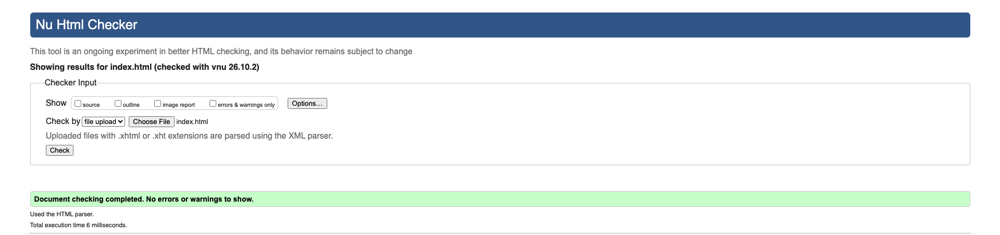
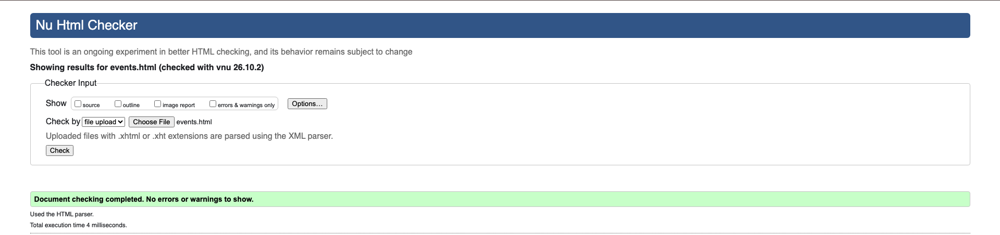
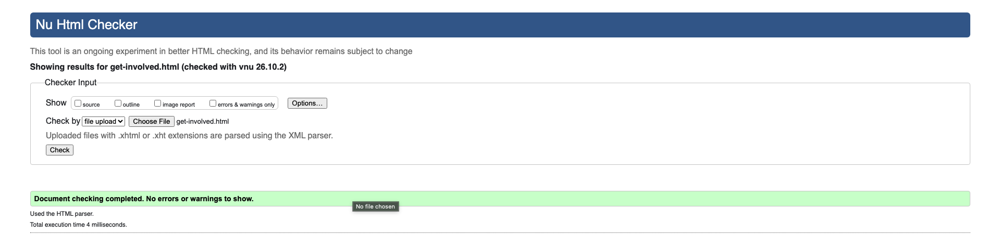
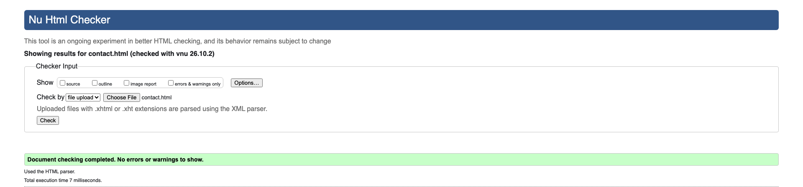

# Metadata structures, inventory, evidence, and AI Disclosure

## 1. Metadata Inventory
- Scope: Pages covered: [index.html](index.html), [about.html](about.html), [contact.html](contact.html), [get-involved.html](get-involved.html), [events.html](events.html), [resources.html](resources.html).

- index.html
  - Page purpose: Home / overview and entry point for site sections.
  - Title: Rooted Together | Community Garden Group
  - Meta description: Community garden in Mesa-events, volunteering, and tips for growing in our climate.
  - Canonical: self (use absolute production URL on publish).
  - Primary heading: site hero H1 (homepage hero headline).
  - User task: Find ways to join, view upcoming events, and explore resources.

- about.html
  - Page purpose: Origin story, mission, values, and team.
  - Title: About | Rooted Together
  - Meta description: Learn about Rooted Together-our mission, values, and how the community garden started.
  - Canonical: self.
  - Primary heading: "We made the green dream into something real." (H1)
  - User task: Understand mission and decide to join or support.

- contact.html
  - Page purpose: Contact form and practical contact details.
  - Title: Contact | Rooted Together
  - Meta description: Contact Rooted Together for volunteering, questions, or event info.
  - Canonical: self.
  - Primary heading: "Connect with a root near you." (H1)
  - User task: Reach out or request info / directions.

- get-involved.html
  - Page purpose: Calls to action-join, volunteer, donate, or attend workdays.
  - Title: Get Involved | Rooted Together
  - Meta description: Ways to volunteer, donate, and participate with Rooted Together community garden.
  - Canonical: self.
  - Primary heading: "Let’s go in the garden." (H1)
  - User task: Sign up or find the next workday.

- events.html
  - Page purpose: Event listings with dates, times, and locations.
  - Title: Events | Rooted Together
  - Meta description: Upcoming workdays and community events at Rooted Together, with dates and locations.
  - Canonical: self.
  - Primary heading: "October workdays at 104 E Glade Ave." (H1)
  - User task: Find event details and add to calendar.

- resources.html
  - Page purpose: How‑to content, tips, and reference notes for local gardening.
  - Title: Resources | Rooted Together
  - Meta description: Practical tips, plant recommendations, and seasonal advice for gardening in Mesa.
  - Canonical: self.
  - Primary heading: "Tips and Tricks-On what grows here." (H1)
  - User task: Learn practical tips and discover recommended plants.


## 2. Titles & Descriptions
- Titles: keep existing titles (unique per file). Ensure production titles include site name and brief context.
- Descriptions: kept concise (90–160 characters), action- or task-oriented, and unique per page.


## 3. Semantic Headings & Crawlable Links
- Page structure: each page uses a single primary `H1` that reflects the page purpose an example is a homepage hero, about story, events listing, etc. Secondary sections use `H2` headings for major tasks or content groups and `H3` for finer-grained subsections so heading hierarchy maps to user tasks.

- Descriptive, crawlable links: internal navigation and in-content anchors are plain `<a href="...">` links with clear, task-focused link text (for example, "Find a workday" → `events.html`, "Sign up to volunteer" → `get-involved.html`). Links avoid generic phrasing like "click here" so crawlers and assistive tech can infer target content.

- Navigation & discoverability: a consistent header nav and footer links expose primary pages sitewide so crawlers discover all pages from the homepage. Important pathways (signup, contact, events) are surfaced in the main nav and in contextual CTAs within pages.

- Accessibility & machine-readability: a skip-to-content link exists for keyboard users; headings are used for logical reading order; link text and nearby heading/lead copy provide context for images and links. No navigation requires JavaScript-only interactions — all internal links are crawlable plain anchors.

- Authoring practices to maintain: keep one `H1` per page, use headings to encode tasks (user-task → heading), use descriptive anchor text, prefer relative `href` example is `about.html`, during development and update canonical/absolute URLs at publish time, and add `rel="noopener"` for external targets.

- Examples (implemented): the homepage hero uses an `H1` summarizing site purpose; the events page uses `H2` per event grouping and article-level headings; the header nav links to `index.html`, `about.html`, `events.html`, `get-involved.html`, `resources.html`, and `contact.html` so important pages are crawlable from the site root.


## 4. Canonical, Robots, and Sitemap Notes
- Decision: do NOT publish or include `robots.txt` or `sitemap.xml` for this project. Any draft files have been removed from the repository at the owner's request.

- Reasoning: You chose to avoid providing site-root crawler directives or a sitemap from this repo to prevent accidental indexing or exposure of staging content. Canonical links remain self-referential in the files; update them to production absolute URLs when you publish the site.

- Risks: Without a sitemap, crawlers may discover pages more slowly; without `robots.txt`, crawlers follow default behavior. These trade-offs are intentional given the decision to omit site-root files.


## 5. Social Metadata (example for shareable page: homepage)
- Add Open Graph metadata for Facebook (and other platforms that respect `og:`) to `<head>` on the page you expect to share. Replace domain and image URL with production values. Example:

```html
<meta property="og:site_name" content="Rooted Together" />
<meta property="og:title" content="Rooted Together | Community Garden Group" />
<meta property="og:description" content="Community garden in Mesa-events, volunteering, and tips for growing in our climate." />
<meta property="og:url" content="https://rootedTogether.org/" />
<meta property="og:type" content="website" />
<meta property="og:image" content="https://rootedTogether.org/Images/Hero-1200.jpg" />
<!-- Optional: provide your Facebook App ID to enable Insights and debugging -->
<meta property="fb:app_id" content="YOUR_FB_APP_ID" />
```

## 6. Structured Data (JSON‑LD)
- Timezone: all event date times use Mountain Time (Arizona) encoded as `-07:00`.

Sitewide example:

```json
{
  "@context": "https://schema.org",
  "@type": "WebSite",
  "url": "https://rootedtogether.org/",
  "name": "Rooted Together",
  "publisher": {
    "@type": "Organization",
    "name": "Rooted Together",
    "logo": {
      "@type": "ImageObject",
      "url": "https://rootedtogether.org/Images/logo.svg"
    }
  }
}
```

Per-event JSON‑LD (inserted into `events.html` near each event `article`, actual events added):

- "Fall planting party": `startDate`: "2026-10-03T09:00:00-07:00", `endDate`: "2026-10-03T11:00:00-07:00"
- "Harvest and share": `startDate`: "2026-10-17T10:00:00-07:00", `endDate`: "2026-10-17T12:00:00-07:00"
- "Compost 101": `startDate`: "2026-10-31T09:00:00-07:00", `endDate`: "2026-10-31T10:30:00-07:00"

Validation: the Event JSON‑LD was validated, see `screenshots/JSON-ID_validator.png` added to the evidence bundle. If you want additional validation (Google Rich Results Test), I can run that and add the resulting screenshot.

## 7. Image Discoverability
- Summary: each important image should have a meaningful filename, descriptive `alt` text, nearby explanatory text or caption, and explicit pixel `width`/`height` attributes for better layout stability and crawler context. Below are the site images, the current decisions in the HTML, and recommended exact dimension values derived from the page markup.

- Images/logo.svg
  - Filename: Images/Logo.svg
  - Current `alt`: "rooted together logo" (keeps branding accessible)
  - Usage: shown in header and footer across all pages
  - Dimensions: SVG (scalable). Rendered in HTML as `width="44" height="44"` for the brand header. Keep the source SVG with a viewBox so it scales crisply.
  - Surrounding text/context: wrapped in an anchor to the homepage and accompanied by the site name text - good for both users and machines.

- Images/Hero-1200.jpg, Images/Hero-800.jpg, Images/Hero-400.jpg (homepage hero)
  - Filenames: Images/Hero-1200.jpg (large), Images/Hero-800.jpg (medium), Images/Hero-400.jpg (small)
  - Current `alt` (index): "Community volunteers planting native shrubs along a riverbank." - descriptive and task-relevant (good).
  - Page relevance: primary homepage hero image - supports branding and social shares.
  - Dimensions (recommended and reflected in markup):
    - Hero-1200.jpg - 1200 × 800 px
    - Hero-800.jpg - 800 × 533 px (used with `width="800" height="533"` in markup)
    - Hero-400.jpg - 400 × 267 px
  - Surrounding text/context: the hero has an eyebrow, H1, and a short lead paragraph describing the garden - this gives semantic context for image indexing. Keep a short caption in the hero-note if an editorial note is needed.

- Images/cactusPots-1200.jpg, Images/cactusPots-800.jpg, Images/cactusPots-400.jpg (photo-band / resources)
  - Filenames: Images/cactusPots-1200.jpg (large), Images/cactusPots-800.jpg (medium), Images/cactusPots-400.jpg (small)
  - Current `alt` (index photo-band): "Potted succulents and cactus on a wooden table" - descriptive and concise.
  - Page relevance: used in the photo-band on the homepage and referenced as social image for resources page.
  - Dimensions (recommended):
    - cactusPots-1200.jpg - 1200 × 800 px
    - cactusPots-800.jpg - 800 × 533 px
    - cactusPots-400.jpg - 400 × 267 px
  - Surrounding text/context: nearby H2 and link to contact/visit text - this contextual copy helps image discoverability.

- Images/birdHouse-1200.jpg, Images/birdHouse-800.jpg, Images/birdHouse-400.jpg (about page)
  - Filenames: Images/birdHouse-1200.jpg (large), Images/birdHouse-800.jpg (medium), Images/birdHouse-400.jpg (small)
  - Current `alt` (about): "A wooden birdhouse surrounded by leafy garden plants" - descriptive, mentions objects visible.
  - Page relevance: hero-image on About page - supports storytelling and provides a distinct visual for social shares of the About page.
  - Dimensions (current markup): medium uses `width="800" height="533"` - recommended sizes are 1200×800, 800×533, 400×267 respectively.
  - Surrounding text/context: appears beside the site story and values copy - consider adding a `<figcaption>` if the birdhouse has a provenance note (photographer, date) that adds search-relevant metadata.

- Accessibility & alt guidance:
  - Use short, descriptive alt text that describes the essential content and function. For decorative images that do not add information, use empty `alt=""` and `role="img"` if needed, but avoid this for hero/illustrative photos.
  - Prefer human-readable captions in a `<figcaption>` or near the image to add context (who, why, where).

- File & URL recommendations:
  - Keep filenames lowercase and hyphen-separated (already followed). Example good filename: `Images/cactusPots-800.jpg`.
  - Ensure each derivative exists in `Images/` and that HTML `srcset` values point to accurate files.
  - For `og:image`, prefer the 1200×630 or similar 1.91:1 aspect ratio for best FB preview, if you keep the current 3:2 images, also provide `og:image:width` and `og:image:height` meta tags.

- Example `og:image` width/height tags to add (replace with actual px if different):
  ```html
  <meta property="og:image" content="https://rootedtogether.org/Images/Hero-1200.jpg" />
  <meta property="og:image:width" content="1200" />
  <meta property="og:image:height" content="800" />
  ```

- Implementation notes:
  - The repo's HTML already includes `alt` and `width`/`height` attributes for the homepage hero, `cactusPots`, and `birdHouse` images - good progress.
  - Action item: add or export the image derivative files into the `Images/` folder with the exact filenames listed above (if not already present), and add the `og:image:width`/`og:image:height` tags to the pages used for social sharing (homepage and About/Resources if desired).


## 8. Validation Evidence (checks performed)
- Notes: I validated HTML for the pages locally and the W3C HTML checker reported "Document checking completed. No errors or warnings to show." — include the corresponding screenshots named above to complete the evidence bundle, and I used the schema markup validator(https://validator.schema.org/) and return no errors.

- Evidence files: add the validator screenshots to the `/screenshots` folder with these filenames (example names). If you already have screenshots, copy them into that folder so they are tracked with the project.
  - `screenshots/index_SS.png` — W3C/nu Html Checker result for `index.html` (no errors)
  - `screenshots/about_SS.png` — W3C/nu Html Checker result for `about.html` (no errors)
  - `screenshots/events_SS.png` — W3C/nu Html Checker result for `events.html` (no errors)
  - `screenshots/get-involved_SS.png` — W3C/nu Html Checker result for `get-involved.html` (no errors)
  - `screenshots/resource_SS.png` — W3C/nu Html Checker result for `resources.html` (no errors)
  - `screenshots/contact_SS.png` — W3C/nu Html Checker result for `contact.html` (no errors)
  - `screenshots/JSON-ID_validator.png` — Schema/JSON‑LD validator evidence for `events.html` (Event JSON‑LD)

Evidence:








## 9. Ranking-Claim Limits (what we WILL NOT claim)
- Guaranteed top rankings: We will not claim the site will appear on page one for specific keywords-search ranking depends on many factors beyond on‑page metadata (competition, domain history, backlinks).
- CTR/conversion guarantees: We will not promise specific click-through or donation/volunteer conversion rates from metadata changes alone-these require A/B testing and traffic data.


# AI Disclosure
- AI helped me organize the inventory, draft alternatives, and help me understand to better explain the documentation.